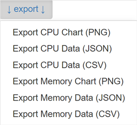

# Built-in Dashboards and Charts of kube-opex-analytics
This section describes the built-in dashboards and charts provided by `kube-opex-analytics`. 

- [Built-in Dashboards and Charts of kube-opex-analytics](#built-in-dashboards-and-charts-of-kube-opex-analytics)
  - [Hourly Consolidated Usage Trends (7 days)](#hourly-consolidated-usage-trends-7-days)
  - [Hourly Usage/Requests Efficiency (7 days)](#hourly-usagerequests-efficiency-7-days)
  - [Daily Consumption Accounting (14 days)](#daily-consumption-accounting-14-days)
  - [Monthly CPU and Memory Usage (12 months)](#monthly-cpu-and-memory-usage-12-months)
  - [Nodes' Occupation by Pods](#nodes-occupation-by-pods)
  - [Export Charts and Datasets (PNG, CSV, JSON)](#export-charts-and-datasets-png-csv-json)
- [Dashboards and Visualization with Grafana](#dashboards-and-visualization-with-grafana)

## Hourly Consolidated Usage Trends (7 days)
For each namespace discovered in the target Kubernetes cluster, this dashboard section displays hourly usage trends for CPU and memory resources during the last week (7 days). The aim of these charts is to help understand trends of actual resource usage by each namespace, but also globally thanks to the stacked-area charts.

The date filter can be used to zoom out/in on a specific time range.

These charts are based on data consolidated hourly thanks to sample metrics collected every five minutes from Kubernetes. 

## Hourly Usage/Requests Efficiency (7 days)
For each namespace discovered in the target Kubernetes cluster, this dashboard section displays hourly usage/requests efficiency trends for CPU and memory resources during the last week (7 days). The aim of these charts is to help understand how efficient resource requests set on Kubernetes workloads are, compared against the actual resource usage over time.

The date filter can be used to zoom out/in on a specific time range.

These charts are based on data consolidated hourly thanks to sample metrics collected every five minutes from Kubernetes. 

## Daily Consumption Accounting (14 days)
The daily accounting charts are provided per namespace for CPU and Memory resources and cover the last 14 days (2 weeks).

According to the [selected accounting model (](design-fundamentals.md#usage-accounting-models), the charts display one of the following metrics :

* Daily cumulative sum of actual hourly consumption per namespace.
* Daily cumulative sum of the maximum between the actual hourly consumption and the requested capacities.
* Daily cumulative sum of actual hourly computedd from an actual cluster cost set statically based on a fixed hourly rate, or determinated dynamically from allocated resources on public clouds (nodes, storage, etc.).
  

## Monthly CPU and Memory Usage (12 months)
For the different namespaces discovered in the Kubernetes cluster, these charts show monthly cumulative usage for CPU and memory resources during the last 12 months. 

The charts are based on data consolidated hourly thanks to sample metrics collected every five minutes from Kubernetes. 

Depending on the [selected accounting model](design-fundamentals.md#usage-accounting-models), the values on these charts can be actual costs (`CHARGE_BACK` model), cumulative usage (sum of hourly consolidated usage, `CUMULATIVE_RATIO` model), or a percentage of the global cluster usage (`CHARGE_BACK` model, `100%` means the total cluster capacity).

## Nodes' Occupation by Pods
For each node discovered in the Kubernetes cluster, this dashboard section displays the CPU and the memory resources currently consumed by running pods. The data are refreshed every five minutes.

## Export Charts and Datasets (PNG, CSV, JSON)
Any chart provided by kube-opex-analytics can be exported, either as PNG image, CSV or JSON data files.

* Go to the target chart section.
* Click on the link `export`, then select the target exportion format. This action shall download the artifact instantly.

# Dashboards and Visualization with Grafana
In addition or alternatively to the built-in dashboards, it's also possible to [use Grafana for visualization](./prometheus-exporter-grafana-dashboard.md) thanks to the Prometheus exporter natively enabled by `kube-opex-analytics`.